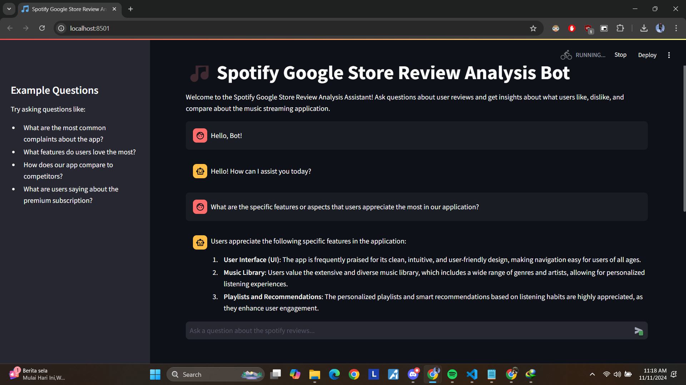
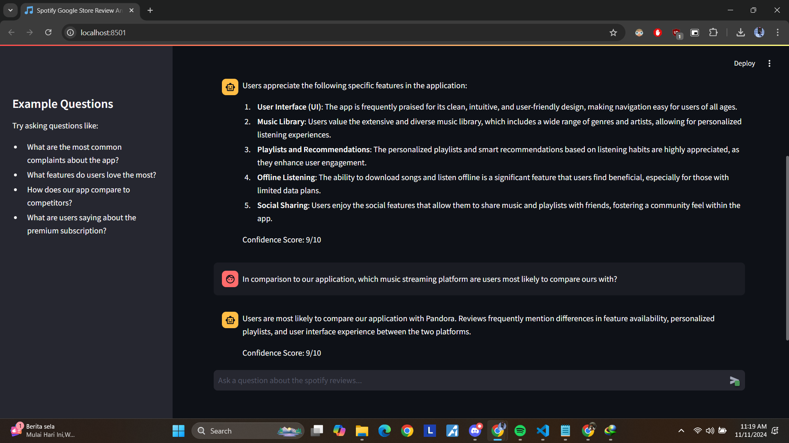

# Q&A Chatbot for Google Store Reviews

This project is a Q&A tool designed to extract actionable insights from a large dataset of Google Store reviews for a music streaming application, such as Spotify. The tool leverages natural language processing and vectorized databases to provide insightful responses to management queries.

## Table of Contents
1. [Introduction](#introduction)
2. [Objectives](#objectives)
3. [Dataset Overview](#dataset-overview)
4. [Features](#features)
5. [Setup and Installation](#setup-and-installation)
6. [Objectives 1](#objective-1-data-preprocessing-and-vectorized-database-creation)
7. [Objectives 2](#objective-2-rag-chain-creation)
8. [Objectives 3](#objective-3-build-a-chatbot-ui)
9. [Usage](#usage)
10. [Screenshots](#screenshots)
11. [Acknowledgments](#acknowledgments)

## Introduction
This project addresses the challenge of extracting insights from 3.4 million unstructured Google Store reviews. The management of a music streaming application requires insights into what users like, dislike, compare, and suggest about the application. This tool aims to provide an efficient way to extract this information using AI and vectorized storage.

## Objectives

The primary objectives of this project are:

1. **Data Preprocessing and Vectorized Database Creation**: Preprocess the Google Store reviews dataset and create a vectorized database for efficient information retrieval.
2. **RAG Chain Creation**: Develop a Retrieval-Augmented Generation (RAG) chain to retrieve relevant information based on management's queries.
3. **Build a Chatbot UI**: Design and implement a user-friendly chatbot interface using Streamlit to allow easy interaction with the Q&A tool.

## Dataset Overview

The dataset contains Google Store reviews of a music streaming application. It includes:
- **Review ID**: Unique identifier for each review.
- **Pseudo Author ID**: Anonymized identifier for the author.
- **Author Name**: Name of the reviewer (anonymized).
- **Review Text**: Content of the review.
- **Review Rating**: Numeric rating provided by the user.
- **Review Likes**: Number of likes the review received.
- **App Version**: Version of the application reviewed.
- **Review Timestamp**: Date and time of the review.

The dataset can be accessed through one of these below:
- Dataset: [Download here](https://drive.google.com/file/d/1_xaRB6d2K_9-1dUmdU0GjtaqPO7uQnTM/view)
- Dataset source: [Kaggle - Spotify Google Store Reviews](https://www.kaggle.com/datasets/bwandowando/3-4-million-spotify-google-store-reviews/)

## Features

- **Question Answering**: Answers questions based on user reviews of the music streaming app.
- **Insights on Competitors**: Provides comparisons with other music streaming platforms.
- **User-Friendly Interface**: Streamlit-based UI with chat history and sample queries.
- **Interactive Typing Animation**: Simulates typing for a conversational experience.

## Setup and Installation

### Frameworks and Libraries

This project utilizes the following frameworks and libraries:

1. **Python** 3.12.7
2. **[CUDA]**(https://developer.nvidia.com/cuda-toolkit) (optional, for GPU support)
3. **OpenAI** 1.7.2
   - Embedding model: `text-embedding-ada-002`
   - Chat model: `gpt-4o-mini`
4. **Chroma** 0.4.22 (Vector Database)
5. **LangChain** 0.1.0
6. **Streamlit** 1.40.0

### Installation Steps
1. Clone the repository:
   ```bash
   git clone https://github.com/yourusername/qna-chatbot.git
   cd qna-chatbot
2. Install dependencies:
    ```bash
    pip install -r requirements.txt
3. Set up environment variables by creating a `.env` file in the root directory and add your OpenAPI API key:
    ```makefile
    OPENAI_API_KEY=your_openai_api_key
4. (Optional) Verify CUDA support:
    ```python
    import torch
    print("CUDA available:", torch.cuda.is_available())

## Objective 1: Data Preprocessing and Vectorized Database Creation

### Steps
1. **Import Libraries and Set Up Environment**
    - Import necessary libraries and set up environment variables. Check for CUDA support if GPU acceleration is needed.
2. **Load and Preprocess the Data**
    - Load the dataset and select relevant columns.
    - Convert data types as needed and perform any necessary preprocessing, such as handling missing values.
3. **Undersample the Data**
    - To manage the large dataset, perform undersampling by selecting a subset of reviews for each rating level to ensure balanced representation.
4. **Tag Reviews**
    - Add tags based on content to enhance search relevance. Tags may include sentiment (positive, negative), feature mentions (UI, music variety), and comparisons with competitors (e.g., Pandora).
5. **Create Embeddings and Split Documents**
    - Use OpenAI embeddings to vectorize the reviews.
    - Split longer reviews into manageable chunks for improved retrieval.
6. **Create and Persist the Vector Store**
    - Store the vectorized data in Chroma for efficient retrieval.

## Objective 2: RAG Chain Creation

### Steps
1. **Import Libraries and Set Up Environment**
    - Import necessary libraries and set up environment variables. Check for CUDA support if GPU acceleration is needed.
2. **Create Basic RAG Chain**
    - Initialize the embeddings model and chat model.
    - Load the vector store and set up the retriever.
3. **Test the Retriever**
    - Test the retriever by running a sample query to see if it pulls relevant data from the vector store..
4. **Test the RAG Chain**
    - Define a system prompt template and create the RAG chain with a pipeline that combines the retriever, a prompt template, and the chat model.
5. **Create Gradio Answer Bot**
    - Set up a simple chatbot interface using Gradio to interact with the RAG chain.

## Objective 3: Build a Chatbot UI

### How it Works
The bot uses a RAG chain that combines retrieval from a Chroma vector store with language generation from an OpenAI model.
1. **Embeddings Model**: Converts review text into vectors using OpenAI embeddings (`text-embedding-ada-002`).
2. **Chroma Vector Store**: Stores and retrieves vectorized data for quick information retrieval.
3. **Chat Model**: Generates answers with `gpt-4o-mini` based on the retrieved context.
4. **Streamlit Interface**: Provides an interactive UI with chat history and example queries.

## Usage
1. Run the `app.py` file to start the Q&A chatbot:
    ```python
    python app.py
2. Use the chatbot interface to query specific insights, such as:
    - "What are the features users appreciate most?"
    - "What are common complaints?"
3. The chatbot retrieves relevant reviews and provides summarized insights based on the vectorized data.

## Screenshots


[Demonstration of Spotify Review Analysis Bot](assets/videos/demo.mp4)

## Acknowledgments
1. **LangChain** for data connection and embedding management.
2. **Chroma** for the vector database used to store embeddings.
3. **OpenAI** for embedding models used in vectorizing text data.
4. **Streamlit (and Gradio)** for creating the chatbot interface.
4. **Naada Taiyab** on [Youtube](https://youtu.be/MUJUXmz2i6U?si=IIYxoB0KKOLenEKl) and [GitHub](https://github.com/nadaataiyab/nutritionfacts_chat/tree/main)
5. **Coding is Fun** on [Youtube](https://youtu.be/sBhK-2K9bUc?si=EgYqNexraPD-Jqco)